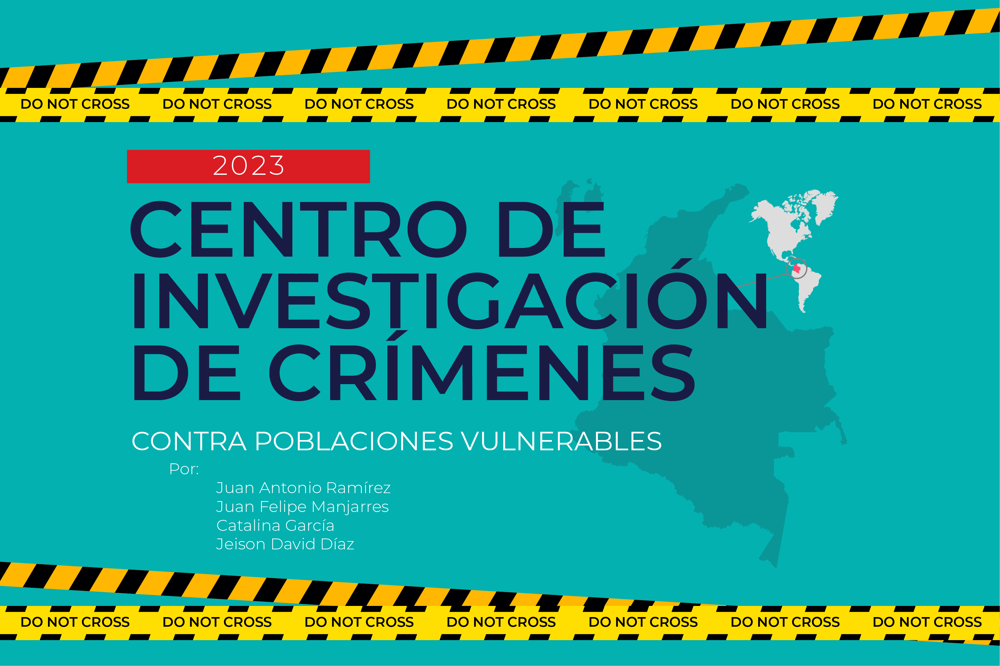

<h1 align="center">
  <a href="https://github.com/jmanjarresm/Proyecto_Final_Aprend_Sup_g17">
    <!-- Please provide path to your logo here -->
    
  </a>
</h1>

  Descripción del sector automotor de Colombia
   
  <a href="#about"><strong>Explorar screenshots »</strong></a>
   
   
  <a href="https://github.com/jmanjarresm/Proyecto_Final_Aprend_Sup_g17/issues/new?assignees=&labels=bug&template=01_BUG_REPORT.md&title=bug%3A+">Report a Bug</a>
  ·
  <a href="https://github.com/jmanjarresm/Proyecto_Final_Aprend_Sup_g17/issues/new?assignees=&labels=enhancement&template=02_FEATURE_REQUEST.md&title=feat%3A+">Request a Feature</a>
  .
  <a href="https://github.com/jmanjarresm/Proyecto_Final_Aprend_Sup_g17/issues/new?assignees=&labels=question&template=04_SUPPORT_QUESTION.md&title=support%3A+">Ask a Question</a>

 

Table of Contents

- [Acerca de](#acerca-de)
  - [Creado con](#creado-con)
- [Empezando](#empezando)
  - [Prerrequisitos](#prerrequisitos)
  - [Instalación](#instalacion)
- [Usos](#usos)
- [Hoja de Ruta](#hoja-de-ruta)
- [Soporte](#soporte)
- [Contribuciones](#contribuciones)
- [Autores](#autores)
- [Licencia](#licencia)
- [Agradecimientos](#agradecimientos)

---

## Acerca de

<table><tr><td>

> **[?]**
> Provide general information about your project here.
> What problem does it (intend to) solve?
> What is the purpose of your project?
> Why did you undertake it?
> You don't have to answer all the questions -- just the ones relevant to your project.

Screenshots

 

> **[?]**
> Please provide your screenshots here.

|                               Home Page                               |                               Login Page                               |
| :-------------------------------------------------------------------: | :--------------------------------------------------------------------: |
|  |  |

</td></tr></table>

### Creado con

> **[?]**
> Please provide the technologies that are used in the project.

## Empezando

### Prerrequisitos

> **[?]**
> What are the project requirements/dependencies?

### Instalación

> **[?]**
> Describe how to install and get started with the project.

## Usos

> **[?]**
> How does one go about using it?
> Provide various use cases and code examples here.

## Hoja de Ruta

See the [open issues](https://github.com/jmanjarresm/Proyecto_Final_Aprend_Sup_g17/issues) for a list of proposed features (and known issues).

- [Top Feature Requests](https://github.com/jmanjarresm/Proyecto_Final_Aprend_Sup_g17/issues?q=label%3Aenhancement+is%3Aopen+sort%3Areactions-%2B1-desc) (Add your votes using the 👍 reaction)
- [Top Bugs](https://github.com/jmanjarresm/Proyecto_Final_Aprend_Sup_g17/issues?q=is%3Aissue+is%3Aopen+label%3Abug+sort%3Areactions-%2B1-desc) (Add your votes using the 👍 reaction)
- [Newest Bugs](https://github.com/jmanjarresm/Proyecto_Final_Aprend_Sup_g17/issues?q=is%3Aopen+is%3Aissue+label%3Abug)

## Soporte

> **[?]**
> Provide additional ways to contact the project maintainer/maintainers.

Reach out to the maintainer at one of the following places:

- [GitHub issues](https://github.com/jmanjarresm/Proyecto_Final_Aprend_Sup_g17/issues/new?assignees=&labels=question&template=04_SUPPORT_QUESTION.md&title=support%3A+)
- Contact options listed on [this GitHub profile](https://github.com/jmanjarresm)

## Contribuciones

First off, thanks for taking the time to contribute! Contributions are what make the open-source community such an amazing place to learn, inspire, and create. Any contributions you make will benefit everybody else and are **greatly appreciated**.

Please read [our contribution guidelines](docs/CONTRIBUTING.md), and thank you for being involved!

## Autores

The original setup of this repository is by [Juan Felipe](https://github.com/jmanjarresm).

For a full list of all authors and contributors, see [the contributors page](https://github.com/jmanjarresm/Proyecto_Final_Aprend_Sup_g17/contributors).

## Licencia

This project is licensed under the **MIT license**.

See [LICENSE](LICENSE) for more information.

## Agradecimientos

> **[?]**
> If your work was funded by any organization or institution, acknowledge their support here.
> In addition, if your work relies on other software libraries, or was inspired by looking at other work, it is appropriate to acknowledge this intellectual debt too.
